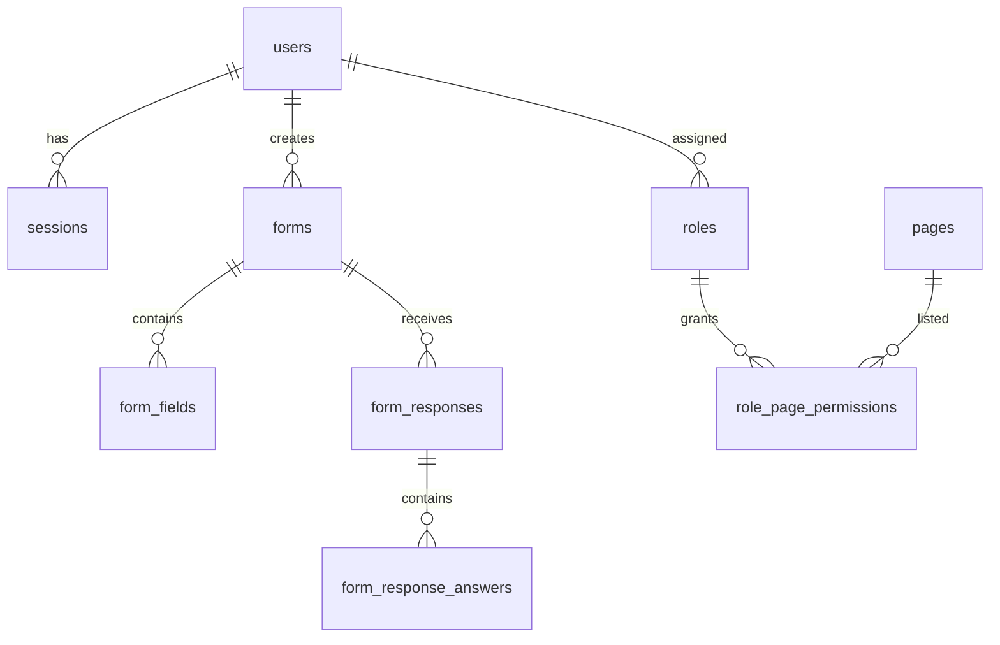

# Product Requirements Document (PRD)

## ChaiForms — Form Builder SaaS (working title)

| Field | Value |
|-------|--------|
| **Document version** | 1.0.0 |
| **Last updated** | 2026-05-20 |
| **Audience** | Engineers, hackathon judges, **AI coding agents** |
| **Repository** | `trpc-monorepo` (pnpm + Turborepo) |
| **Hackathon** | Solo · production-style Typeform-like form builder |

> **For AI agents:** Read this file first. Implement work in **phase order** (§8). Do not skip Phase 1 (auth). Reference exact paths in §12. Mark acceptance criteria (§13) before moving to the next phase.

---

## 1. Executive summary

Build a **production-style form builder SaaS** where **creators** authenticate, design dynamic forms, publish shareable links, and review responses/analytics. **Respondents** fill published forms **without logging in**.

The monorepo already contains:

- **Backend scaffold:** Express API (`apps/api`), tRPC (`packages/trpc`), Drizzle/Postgres (`packages/database`), Scalar docs at `/docs`
- **Frontend shell:** Vite + React 19 dashboard (`apps/web`) migrated from Creative Dash — auth UI, admin pages, layout — but wired to a **missing Django-style REST API**

**Immediate priority (Phase 1):** Implement **backend authentication & authorization** (email/password, sessions, roles) so sign-in/sign-up works and users can reach a **marketing landing page** → **creator dashboard**. Strip unrelated creative/marketing features from the frontend in parallel or immediately after auth works.

**Product name:** Hackathon name is *ChaiForms*; final branding TBD.

---

## 2. Goals & success metrics

### 2.1 Primary goals

| # | Goal |
|---|------|
| G1 | Creators can register, sign in, and access a role-appropriate dashboard |
| G2 | Creators can CRUD forms with dynamic fields, validation, themes, publish/unpublish |
| G3 | Public respondents submit published forms without auth |
| G4 | Public vs **unlisted** visibility enforced server-side |
| G5 | Responses, analytics, email notifications, rate limiting |
| G6 | Judge-ready demo: landing, pricing, deployment, Scalar API docs, seeded data, demo credentials |

### 2.2 Hackathon compliance (must-have stack)

| Requirement | Implementation |
|-------------|----------------|
| Turborepo | Root `turbo.json`, `pnpm-workspace.yaml` |
| tRPC | `packages/trpc` — all business APIs |
| Zod | Shared schemas in `packages/trpc` / `packages/database` |
| Drizzle ORM | `packages/database` |
| Scalar | `apps/api` → `GET /docs` |
| Separate frontend & backend | `apps/web`, `apps/api` |
| Shared packages | `@repo/trpc`, `@repo/services`, `@repo/database` |

---

## 3. User personas & roles

### 3.1 Personas

| Persona | Description | Auth required |
|---------|-------------|---------------|
| **Visitor** | Browses landing/pricing, may browse public explore | No |
| **Respondent** | Fills a published form via link | No |
| **Creator (Consumer)** | Builds and manages own forms & responses | Yes |
| **Admin** | Manages users and platform settings within policy | Yes |
| **Superadmin** | Full platform control, all users/forms, role assignment | Yes |

### 3.2 Role model

Three roles (stored on user, enforced on every protected procedure):

| Role | Code | Capabilities |
|------|------|--------------|
| **Superadmin** | `superadmin` | Everything. All users, all forms, User Management (create/edit/deactivate, assign roles including admin & superadmin), Access Control, bypass page permission checks |
| **Admin** | `admin` | Platform administration per policy (users, access control); **not** full superadmin unless granted — define as: manage consumers, view aggregate analytics; cannot demote superadmins |
| **Consumer / Customer** | `consumer` | Creator dashboard only: **own** forms, **own** responses, **own** analytics; no User Management or Access Control |

**Rule:** `superadmin` flag or role check must be authoritative on the **server**. Frontend `PermissionRoute` is UX only.

### 3.3 Permission matrix (pages)

| Page slug | Path | Superadmin | Admin | Consumer |
|-----------|------|:----------:|:-----:|:--------:|
| `dashboard` | `/dashboard` | ✓ | ✓ | ✓ (own metrics) |
| `forms` | `/forms` | ✓ all | ✓ all | ✓ own only |
| `submissions` | `/submissions` | ✓ all | ✓ all | ✓ own only |
| `explore` | `/explore` | ✓ | ✓ | ✓ (read) |
| `user-management` | `/user-management` | ✓ | ✓* | ✗ |
| `access-control` | `/access-control` | ✓ | ✓* | ✗ |

\*Admin access to admin pages is configurable via Access Control (Phase 2+); default: admin has user-management, not role promotion to superadmin.

---

## 4. Current state vs target

### 4.1 What exists today

```
trpc-monorepo/
├── apps/
│   ├── api/          Express :8000 — /trpc, /api (OpenAPI), /docs (Scalar)
│   └── web/          Vite :3000 — Creative Dash UI (misaligned API)
├── packages/
│   ├── trpc/         Routers: health, auth (Google provider list only)
│   ├── services/     UserService (OAuth URL only)
│   └── database/     users table (no password, no role, no sessions)
```

| Area | Status |
|------|--------|
| DB `users` | `id`, `email`, `full_name`, `email_verified`, `profile_image_url`, timestamps |
| Auth API | **Missing** — only `getSupportedAuthenticationProviders` |
| Web auth UI | Sign-in, forgot/reset/set password — calls `/api/auth/*` (not implemented) |
| Sign-up page | **Missing** |
| Landing / pricing | **Missing** |
| Forms feature | **Missing** |
| Admin UI | User Management + Access Control present (needs backend) |

### 4.2 Frontend features to **remove** (not in MVP)

Remove routes, sidebar entries, API modules, and pages:

| Feature | Paths to remove |
|---------|-----------------|
| Ecommerce dashboard | `/`, `pages/Dashboard/Home.tsx`, `components/ecommerce/*` |
| Creatives | `/creatives`, `/creatives/viewer`, `pages/Creatives/*` |
| Brands | `/brands`, `pages/Brands/*` |
| Ad Mockup Studio | `/tools/ad-mockup-studio`, `api/mockupAdStudio.ts` |
| Landing Pages tool | `/tools/landing-pages`, preview route, `api/landingPages.ts` |
| Dead code | `routes/RoleBasedRoute.tsx` (unused) |

### 4.3 Frontend features to **keep & adapt**

| Feature | Path |
|---------|------|
| Auth pages | `apps/web/src/pages/Auth/*` + **new** `SignUp.tsx` |
| Auth components | `apps/web/src/components/auth/*` |
| Auth context | `apps/web/src/context/AuthContext.tsx` |
| Route guards | `ProtectedRoute`, `PublicRoute`, `PermissionRoute` |
| Layout | `layout/AppLayout.tsx`, `AppSidebar.tsx`, `AppHeader.tsx` |
| Administration | `pages/Administration/*` (superadmin/admin) |
| Profile | `pages/UserProfile/*` or equivalent |

### 4.4 Frontend features to **add** (later phases)

| Feature | Path (proposed) |
|---------|-----------------|
| Landing page | `pages/Marketing/Landing.tsx` → `/` (public) |
| Pricing page | `pages/Marketing/Pricing.tsx` → `/pricing` |
| Forms list | `pages/Forms/FormsList.tsx` → `/forms` |
| Form builder | `pages/Forms/FormBuilder.tsx` → `/forms/:id/edit` |
| Public fill | `pages/Public/FormFill.tsx` → `/f/:slug` (no app layout) |
| Explore (public forms) | `pages/Explore/Explore.tsx` → `/explore` |
| Thank you | `pages/Public/ThankYou.tsx` |

**Routing note:** After Phase 1, `/` should be the **landing page** (public). Authenticated users go to `/dashboard`. Update `PublicRoute` / default redirects accordingly.

---

## 5. Functional requirements (full product)

### 5.1 Authentication (Phase 1 — detailed in §8)

- Email + password **sign up**, **sign in**, **sign out**
- **Forgot password** → email with reset link/token
- **Reset password** (token from email)
- **Set password** / force password change on first login (`must_reset_password`)
- Session via **HttpOnly cookies** (match existing frontend contract) or documented JWT-in-cookie strategy
- CSRF protection for mutating requests
- Optional later: Google OAuth (stub exists in `packages/services`)

### 5.2 Form management (creators)

- Create, edit, duplicate, archive forms
- Dynamic field types (minimum): short text, long text, email, number, single select, multi select  
  Encouraged: checkbox, dropdown, rating, date
- Per-field: label, placeholder, required/optional, validation rules (Zod-backed)
- Themes (movie/anime/game/startup/tech/OS/event/community presets)
- **Publish** / **unpublish**
- Visibility: **public** (listable in explore) vs **unlisted** (direct link only)
- Custom slug (bonus)
- Preview before publish (bonus)

### 5.3 Public response collection

- No login to submit
- Only **published** forms accept responses
- Unpublished / invalid slug → graceful error UI
- Thank-you / confirmation screen after submit
- Rate limiting on submission endpoint
- Spam protection (basic: rate limit + optional honeypot)

### 5.4 Responses & analytics

- List responses per form (paginated, filterable — bonus)
- Aggregate analytics (counts, charts — bonus)
- Email notifications to creator on new response (and optional respondent confirmation)
- CSV export (bonus)

### 5.5 Marketing & demo

- Landing page, pricing page (no real payments)
- ≥3 themed sample forms with seeded responses
- Demo credentials in README
- Deployed demo URL
- Scalar API documentation

---

## 6. Non-functional requirements

| ID | Requirement |
|----|-------------|
| NFR1 | Monorepo structure preserved; shared Zod schemas between API and web |
| NFR2 | Type-safe APIs via tRPC; OpenAPI/Scalar for judges |
| NFR3 | Postgres schema via Drizzle migrations |
| NFR4 | Rate limiting on public submission routes |
| NFR5 | Server-side visibility checks (public / unlisted / unpublished) |
| NFR6 | Responsive UI, loading states, error boundaries |
| NFR7 | README: setup, env, demo credentials, API doc link |
| NFR8 | No secrets in git; `.env.example` complete |

---

## 7. API design strategy

### 7.1 Dual surface (hackathon-friendly)

| Surface | Path | Consumer |
|---------|------|----------|
| **tRPC** | `/trpc` | Web app (preferred long-term), type-safe |
| **OpenAPI REST** | `/api/*` | Scalar docs, existing axios client during migration |

**Phase 1 decision:** Implement auth as **tRPC procedures** with **OpenAPI metadata** so Scalar documents them AND expose REST-compatible routes via existing `trpc-to-openapi` middleware **or** thin Express routes that call the same services.

**Critical:** The web app today uses **axios + `/api/auth/*`**. Either:

- **Option A (recommended for speed):** Implement REST handlers under `/api/auth/*` in `apps/api` that delegate to `@repo/services` (keeps `apps/web/src/api/auth.tsx` unchanged).
- **Option B:** Migrate web to `@trpc/client` and remove axios auth.

**PRD default for Phase 1:** **Option A** — restore compatibility with `apps/web/src/api/auth.tsx` and `apps/web/src/config/api.ts`.

### 7.2 Auth API contract (must match frontend)

Base URL: `http://localhost:8000` (dev); Vite proxies `/api` → API.

| Method | Endpoint | Request body | Response |
|--------|----------|--------------|----------|
| GET | `/api/auth/csrf/` | — | `{ csrfToken: string }` |
| POST | `/api/auth/login/` | `{ username, password, remember_me? }` | `{ user: AuthUser, must_reset_password?: boolean }` |
| POST | `/api/auth/logout/` | — | `{ success: true }` |
| GET | `/api/auth/me/` | — | `AuthUser` or 401 |
| POST | `/api/auth/refresh/` | — | `{ success: true }` (new session) |
| POST | `/api/auth/register/` | `{ email, password, password_confirm, name? }` | `{ user, must_reset_password? }` **NEW** |
| POST | `/api/auth/force-password-change/` | `{ new_password, new_password_confirm }` | `{ success: true }` |
| POST | `/api/password-reset/` | `{ email }` | `{ success: true }` (generic message) |
| POST | `/api/password-reset-confirm/` | `{ token, password, password2 }` | `{ success: true }` |

**AuthUser shape** (align with `apps/web/src/context/AuthContext.tsx`):

```typescript
{
  id: string;
  email: string;
  name: string;
  username: string;
  first_name: string;
  last_name: string;
  role: "superadmin" | "admin" | "consumer";
  is_superadmin: boolean;  // true iff role === superadmin
  must_reset_password: boolean;
  allowed_pages: { slug: string; name: string; path: string }[];
  allowed_components: { slug: string; name: string; description?: string; category?: string }[];
}
```

---

## 8. Implementation phases (agent execution order)

### Phase 1 — Backend auth & authorization ⭐ START HERE

**Objective:** Login, sign-up, session, roles work end-to-end. User can open landing → sign up → sign in → land on dashboard shell.

#### 1.1 Database schema

Add migration in `packages/database/models/`:

**`users` (extend)**

| Column | Type | Notes |
|--------|------|-------|
| `password_hash` | text | bcrypt/argon2 |
| `role` | enum | `superadmin`, `admin`, `consumer` |
| `username` | varchar unique | defaults from email local-part |
| `must_reset_password` | boolean | default false |
| `is_active` | boolean | default true |
| `first_name`, `last_name` | varchar optional | |

**`sessions` (new)**

| Column | Type |
|--------|------|
| `id` | uuid PK |
| `user_id` | FK users |
| `token_hash` | text |
| `expires_at` | timestamp |
| `created_at` | timestamp |

**`password_reset_tokens` (new)**

| Column | Type |
|--------|------|
| `id` | uuid |
| `user_id` | FK |
| `token_hash` | text |
| `expires_at` | timestamp |
| `used_at` | timestamp nullable |

**Seed** (`packages/database/seed.ts` or script):

| Email | Password | Role |
|-------|----------|------|
| `superadmin@demo.com` | (document in README) | superadmin |
| `admin@demo.com` | (document in README) | admin |
| `creator@demo.com` | (document in README) | consumer |

#### 1.2 Services (`packages/services`)

Create:

```
packages/services/
├── auth/
│   ├── index.ts       # login, register, logout, refresh, me
│   ├── session.ts     # create/validate/revoke session
│   ├── password.ts    # hash, verify, reset flow
│   └── permissions.ts # build allowed_pages/components from role
├── user/
│   └── index.ts       # extend UserService
```

Use **bcrypt** (or argon2) for passwords. Never return `password_hash`.

#### 1.3 tRPC + REST (`packages/trpc`, `apps/api`)

- Extend `createContext` to parse session cookie → `ctx.user | null`
- Add `protectedProcedure` (requires `ctx.user`)
- Add `adminProcedure` / `superadminProcedure` as needed
- Register auth routes with OpenAPI meta for Scalar
- Mount REST handlers in `apps/api/src/server.ts`:
  - `cookie-parser`
  - CORS with `credentials: true` for `http://localhost:3000`
  - CSRF middleware (double-submit cookie or session-bound token)
  - Rate limit on login/register/reset

#### 1.4 Frontend (minimal for Phase 1)

| Task | File |
|------|------|
| Add Sign up page | `pages/Auth/SignUp.tsx`, route `/signup` |
| Sign up form component | `components/auth/SignUpForm.tsx` |
| Register API call | `api/auth.tsx` → `POST /api/auth/register/` |
| Landing page (marketing) | `pages/Marketing/Landing.tsx` → `/` |
| Move dashboard home | `/` → `/dashboard` (new stub page) |
| Update `App.tsx` routes | Public: `/`, `/pricing`, `/signin`, `/signup`, … |
| Update redirects | After login → `/dashboard`; `PublicRoute` allows marketing pages |
| Remove dead features | Per §4.2 (can be sub-task 1.4b) |

#### 1.5 Environment variables

Add to `.env.example`:

```env
SESSION_SECRET=
CSRF_SECRET=
COOKIE_SECURE=false
COOKIE_DOMAIN=localhost
APP_URL=http://localhost:3000
API_URL=http://localhost:8000
# Email (Phase 5) — optional in Phase 1: log reset link to console
SMTP_HOST=
SMTP_PORT=
SMTP_USER=
SMTP_PASS=
EMAIL_FROM=noreply@chaiforms.local
```

#### Phase 1 acceptance criteria

- [ ] `pnpm db:migrate` applies new tables
- [ ] `pnpm db:seed` creates 3 demo users
- [ ] `POST /api/auth/register/` creates consumer user
- [ ] `POST /api/auth/login/` sets HttpOnly session cookie
- [ ] `GET /api/auth/me/` returns user + role + `allowed_pages`
- [ ] Consumer `allowed_pages` excludes `user-management`, `access-control`
- [ ] Superadmin `allowed_pages` includes all pages
- [ ] `POST /api/auth/logout/` clears session
- [ ] Forgot/reset password flow works (email logged in dev if no SMTP)
- [ ] `must_reset_password` redirects to `/set-password`
- [ ] Scalar `/docs` lists auth endpoints
- [ ] Web: `/` shows landing; `/signup` works; sign-in lands on `/dashboard`
- [ ] README lists demo credentials

---

### Phase 2 — User management & access control (admin APIs)

- tRPC/REST for users CRUD, activate/deactivate, role assignment
- Access control: pages + components catalog, role toggles
- Wire `pages/Administration/*` to real APIs
- Superadmin-only: promote to admin/superadmin
- Admin: manage consumers only (policy)

---

### Phase 3 — Forms core (creator)

**Packages:** `packages/database/models/form.ts`, `form_field.ts`, `form_response.ts`

- Form CRUD, draft vs published, slug, visibility (`public` | `unlisted`)
- Field schema JSON validated by shared Zod package (`packages/validators` or `packages/trpc/schema/forms.ts`)
- Form builder UI at `/forms`, `/forms/:id/edit`
- Replace sidebar per §4.4

---

### Phase 4 — Public fill & explore

- `GET /f/:slug` public form render
- `POST` submit response (rate limited)
- Explore page lists **public** published forms only
- Unlisted forms: 404 on explore, accessible via direct link
- Unpublished: 404 + friendly message
- Thank-you page

---

### Phase 5 — Responses, analytics, email

- Response list/detail for creators
- Analytics aggregates + charts (bonus)
- Email on new response (nodemailer or similar)
- Seeded themed forms (≥3) with sample responses

---

### Phase 6 — Marketing, deployment, polish

- Pricing page
- Production deploy (e.g. Railway, Render, Fly + Vercel/Netlify)
- README submission checklist
- Bonus features as time permits (§9)

---

## 9. Bonus features (prioritized backlog)

| Feature | Priority |
|---------|----------|
| Form preview before publish | P1 |
| Public explore page | P1 (required for public forms) |
| Charts / analytics dashboard | P2 |
| Custom form slugs | P2 |
| CSV export | P2 |
| Conditional logic | P3 |
| Form expiry / response limit | P3 |
| QR code sharing | P3 |
| Password-protected forms | P3 |
| Multi-page forms | P3 |
| Form templates / theme gallery | P2 |

---

## 10. Data model (target ER overview)



(Detailed Drizzle definitions to be added in Phase 3+.)

---

## 11. Form visibility rules (server-enforced)

| State | Explore listing | Direct link | Accepts responses |
|-------|-----------------|-------------|-------------------|
| Draft (unpublished) | No | No* | No |
| Published + public | Yes | Yes | Yes |
| Published + unlisted | No | Yes | Yes |
| Archived | No | No | No |

\*Owner preview may work with auth (bonus).

---

## 12. Repository map for AI agents

| Purpose | Path |
|---------|------|
| PRD (this file) | `docs/PRD.md` |
| API entry | `apps/api/src/server.ts` |
| tRPC router root | `packages/trpc/server/index.ts` |
| tRPC context / procedures | `packages/trpc/server/context.ts`, `trpc.ts` |
| DB schema | `packages/database/models/` |
| Migrations | `packages/database/drizzle/` |
| Auth services | `packages/services/auth/` (create) |
| Web routes | `apps/web/src/App.tsx` |
| Web auth API client | `apps/web/src/api/auth.tsx` |
| Web auth context | `apps/web/src/context/AuthContext.tsx` |
| Auth pages | `apps/web/src/pages/Auth/` |
| Admin pages | `apps/web/src/pages/Administration/` |
| Sidebar nav | `apps/web/src/layout/AppSidebar.tsx` |
| API endpoint constants | `apps/web/src/config/api.ts` |
| Env template | `.env.example` |
| Scalar docs | http://localhost:8000/docs |

### Commands

```bash
cd trpc-monorepo
cp .env.example .env && ./setup.sh
docker compose up -d          # Postgres
pnpm install
pnpm db:migrate
pnpm db:seed                # after seed script exists
pnpm dev                    # web :3000 + api :8000
pnpm --filter web dev
pnpm --filter @repo/api dev
```

---

## 13. Acceptance criteria summary (judges)

| Item | Required |
|------|----------|
| Public GitHub repo | Yes |
| Deployed demo link | Yes |
| Demo credentials in README | Yes |
| Scalar API docs link | Yes |
| Landing + pricing pages | Yes |
| ≥3 seeded themed forms + responses | Yes |
| Public + unlisted visibility | Yes |
| Rate limiting on submit | Yes |
| Creator auth | Yes |
| Public submit without login | Yes |
| Real payments | No |

---

## 14. Out of scope (hackathon)

- Real payment / Stripe integration
- Team collaboration / workspaces (unless time permits)
- Mobile native apps
- Plagiarism-sensitive copy-paste without implementation

---

## 15. Open decisions

| # | Decision | Default |
|---|----------|---------|
| D1 | Final product name | ChaiForms (TBD) |
| D2 | Auth transport | HttpOnly session cookie + CSRF (match existing web) |
| D3 | REST vs tRPC for web Phase 1 | REST compatibility layer (Option A §7.1) |
| D4 | Email in Phase 1 | Console-log reset links; SMTP in Phase 5 |
| D5 | Google OAuth | Phase 2+ optional |

---

## 16. Definition of done — Phase 1 (auth + landing)

Phase 1 is complete when a new developer (or AI agent) can:

1. Clone repo, run setup commands in §12
2. Open `http://localhost:3000` → see **landing page**
3. Click **Get started** → sign up as consumer
4. Sign in as `superadmin@demo.com` → see full sidebar including User Management
5. Sign in as `creator@demo.com` → see dashboard only (no admin pages)
6. Sign out and use forgot-password flow
7. View auth endpoints in Scalar at `http://localhost:8000/docs`

**Then proceed to Phase 2.**

---

*End of PRD v1.0.0*
